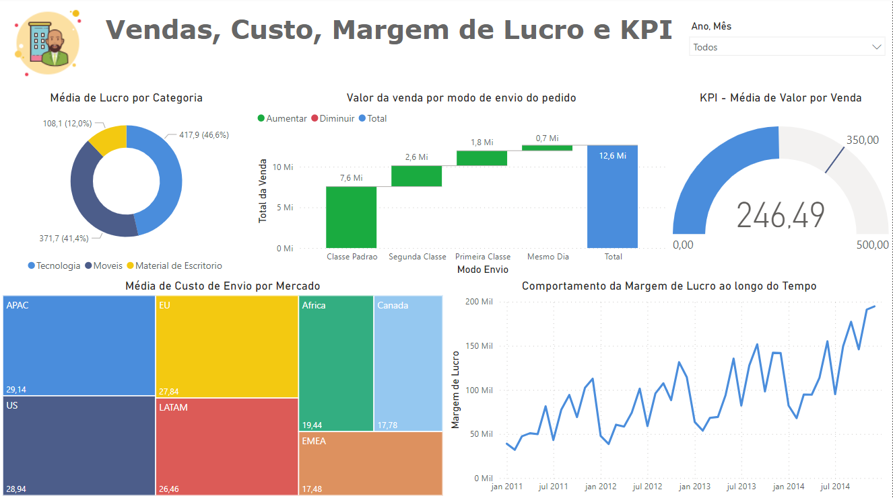
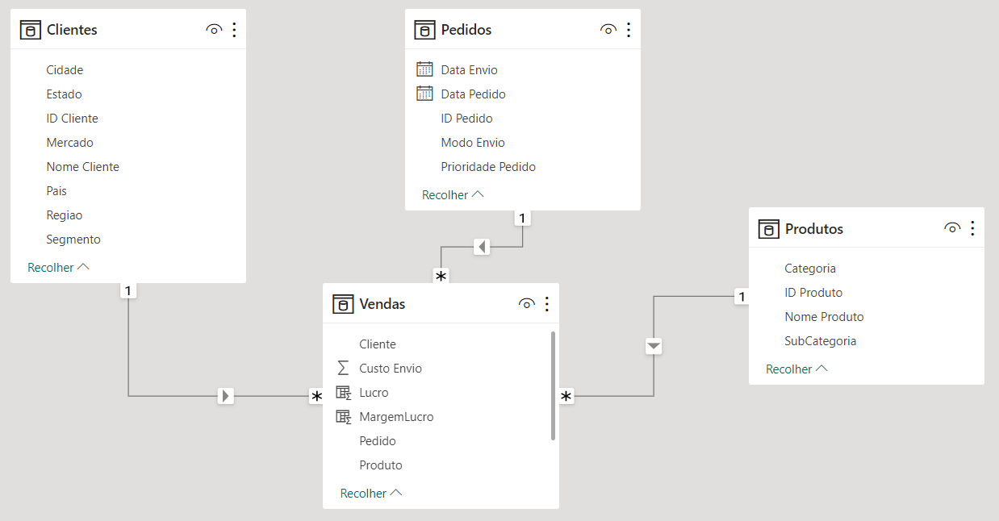

# Dashboard de Vendas
 

  

 

## Sobre o projeto
O dashboard de vendas foi feito com base em dados disponíveis em 4 arquivos diferentes (clientes, pedidos, vendas e produtos) com o objetivo de mostrar informações sobre:

* Qual a média de lucro por categoria de produto?
* Qual o valor da venda por modo de envio do pedido?
* Qual a média de custo de envio por mercado?
* Qual a média de valor de venda? Considerar que a meta é de 350 reais.
* Qual o comportamento da margem de lucro ao longo do tempo?

Além disso, foi implementado ao dashboard a funcionalidade de filtro: por ano e por mês.

Esse projeto exigiu conhecimentos de modelagem de dados, onde foram aplicado os conceitos de relacionamentos e cardinalidade, bem como funções DAX.
 
 

* **[Projeto na íntegra (disponível para download)](https://github.com/raffaloffredo/dashboard_vendas/blob/main/Dashboard_de_Vendas_Custo_Margem_de_Lucro_e_KPI.pbix)**
 

  

 

## Material Extra
Os dados utilizados nesse projeto também estão disponíveis para download.

* **[Clientes](https://github.com/raffaloffredo/dashboard_vendas/blob/main/Clientes.csv)**
* **[Pedidos](https://github.com/raffaloffredo/dashboard_vendas/blob/main/Pedidos.csv)**
* **[Produtos](https://github.com/raffaloffredo/dashboard_vendas/blob/main/Produtos.csv)**
* **[Vendas](https://github.com/raffaloffredo/dashboard_vendas/blob/main/Vendas.csv)**
 

## Outros projetos

* **[Dashboard de Vendas Globais](https://github.com/raffaloffredo/dashboard_vendas_globais/)**
* **[Airbnb New York](https://github.com/raffaloffredo/airbnb_new_york_portuguese)**
* **[Estudo atualizado sobre COVID-19 no Brasil e no mundo](https://github.com/raffaloffredo/covid_2023_portuguese)**
* **[Detecção de fraude em cartão de crédito](https://github.com/raffaloffredo/fraud_detection_portuguese)**
 

 ## Contatos

  
  
  
  

